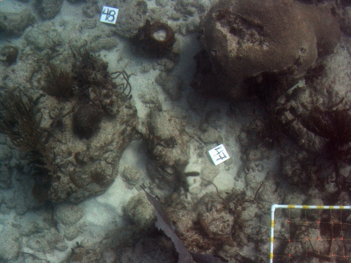
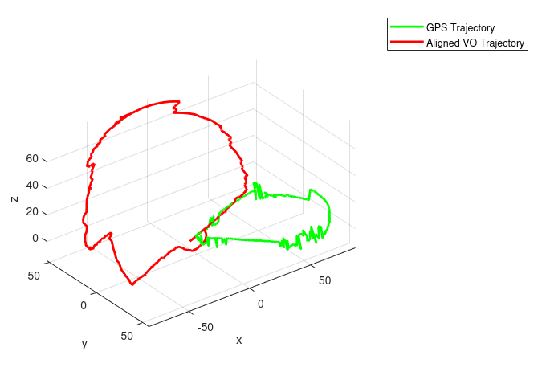

# Multi-View Geometry Labs

Four MATLAB labs covering calibrating a camera, matching and registering a pair of images, computing two-view epipolar geometry and estimating a vehicle's trajectory from a stereo camera.

## Method

- **Lab 1: Camera Calibration**  
Projects known 3D points through a known camera model onto the image. It then estimates the projection matrix from those 2D-3D pairs using the Hall method and decomposes it into instrinsics and pose. Noise is added to the image points so the average projection error can be measured against the number of correspondences. As expected, extra points average the noise out.
- **Lab 2: Feature Extraction and Registration**  
Extracts SIFT features from a pair of images of the same scene from different views and keeps a match only if its best match is clearly better than its second-best (Lowe's ratio test). The surviving matches are used to solve for translation, similarity, affine and projective transforms. RANSAC rejects outlier matches so they don't distort the transform. This matters most for the projective model, which has more degrees of freedom so can overfit to bad matches.
- **Lab 3: Epipolar Geometry**  
For a stereo pair (two cameras viewing the same scene) with known camera matrices, it computes the fundamental matrix that maps a point in one image to its epipolar line in the other. It then checks that each projected 3D point lies on that line, which confirms the matrix correctly captures the relative geometry between the two views.
- **Lab 4: Stereo Visual Odometry**  
Uses consectutive stereo frames captured from a moving vehicle.
Splits each image into a grid of bins and keeps features from every bin so they aren't all clustered in one region. Matches features across the left and right images of consecutive pairs, then estimates the vehicles motion both as a 3D-3D rigid tranform and with Perspective-n-Point (PnP), which recovers pose from 2D image points and their matched 3D scene points. Repeating both methods many times with random pixel noise (i.e. Monte Carlo trials), shows PnP is more robust.

## Run

Requires MATLAB with the Image Processing and Computer Vision toolboxes.

```matlab
cd camera-calibration; Lab01
cd feature-extraction-and-registration; lab2_section3; lab2_section4
cd epipolar-geometry; Lab3
open('stereo-visual-odometry/Lab4.mlx')
```

## Results



*One of the seafloor views used for SIFT matching and transform estimation.*



*The trajectory recovered from 981 stereo pairs (red) aligned to GPS ground truth (green). Both follow the same overall route; the remaining mismatch is drift accumulated up over the run, since there is no loop closure to correct it.*
